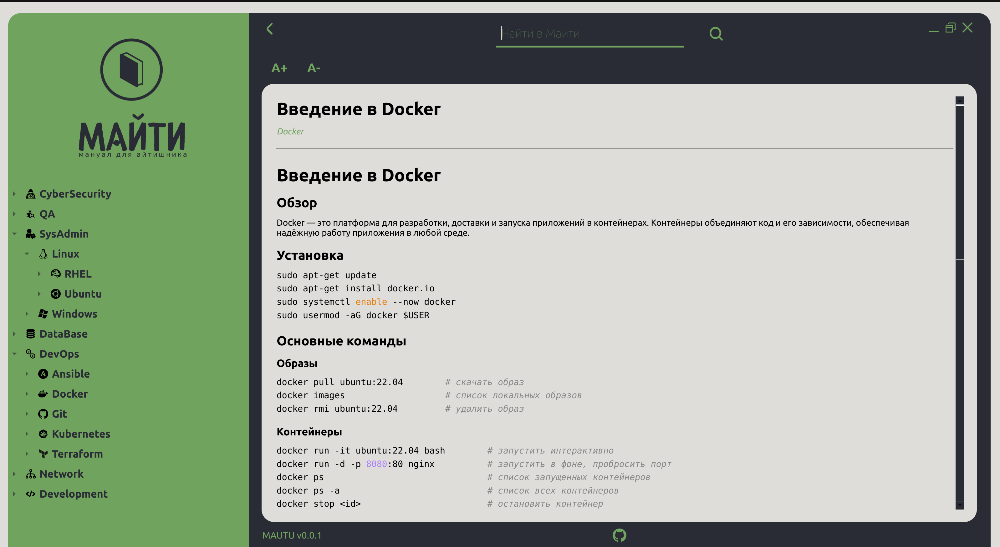

# 📖 MAUTU — Мануал для айтишника



> **MAUTU** (Manual for IT Users) — открытый русскоязычный справочник для IT-специалистов.  
> Любой может добавить или улучшить мануал.


---

## 📚 О проекте

MAUTU — это коллективный справочник по различным областям IT на русском языке.  
Мануалы хранятся в виде Markdown-файлов, что делает их удобными для чтения, редактирования и поиска.

**Для кого:** разработчики, DevOps, сисадмины, сетевые инженеры, QA и все, кто работает в IT.

---

## 🗂️ Структура

```
mautu/
├── linux/          # Linux, bash, администрирование
├── networking/     # Сети, протоколы, инструменты
├── devops/         # Docker, Kubernetes, CI/CD
├── databases/      # SQL, NoSQL базы данных
├── programming/    # Языки программирования
├── security/       # Безопасность, пентест
└── ...             # и другие разделы
```

---

## 🚀 Как использовать

Просто найдите нужный раздел и откройте `.md` файл.  
Все мануалы написаны на русском языке и структурированы по темам.

---

## 🤝 Как внести вклад

Мы рады любому вкладу! Вот как это сделать:

### 1. Форкните репозиторий
```bash
git clone https://github.com/ВАШ_НИК/mautu.git
cd mautu
```

### 2. Создайте ветку
```bash
git checkout -b add/название-мануала
```

### 3. Добавьте или отредактируйте `.md` файл

Следуйте шаблону:

```markdown
# Название мануала

## Описание
Краткое описание темы.

## Установка / Настройка
...

## Примеры использования
...

## Полезные ссылки
- [Ссылка](https://example.com)
```

### 4. Сделайте Pull Request

```bash
git add .
git commit -m "Добавил мануал по [тема]"
git push origin add/название-мануала
```

Затем откройте Pull Request в GitHub.

---

## 📋 Правила контента

- ✅ Пишите на **русском языке**
- ✅ Добавляйте **практические примеры**
- ✅ Проверяйте информацию перед добавлением
- ❌ Без рекламы и спама
- ❌ Без плагиата

---

## 📜 Лицензия

- **Код проекта** — [MIT License](LICENSE)
- **Контент (мануалы)** — [Creative Commons BY 4.0](LICENSE-CONTENT)

---

## ⭐ Поддержите проект

Если проект оказался полезным — поставьте звезду на GitHub!  
Расскажите коллегам, это помогает проекту расти.

---

*Сделано с ❤️ для русскоязычного IT-сообщества*
