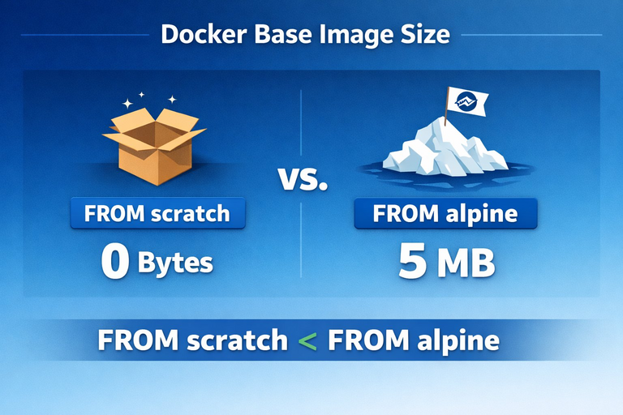

# Введение в Docker

## Обзор

Docker — это платформа для разработки, доставки и запуска приложений в контейнерах.
Контейнеры объединяют код и его зависимости, обеспечивая надёжную работу приложения в любой среде.

## Установка

```bash
sudo apt-get update
sudo apt-get install docker.io
sudo systemctl enable --now docker
sudo usermod -aG docker $USER
```

## Основные команды

### Образы

```bash
docker pull ubuntu:22.04        # скачать образ
docker images                   # список локальных образов
docker rmi ubuntu:22.04         # удалить образ
```

### Контейнеры

```bash
docker run -it ubuntu:22.04 bash        # запустить интерактивно
docker run -d -p 8080:80 nginx          # запустить в фоне, пробросить порт
docker ps                               # список запущенных контейнеров
docker ps -a                            # список всех контейнеров
docker stop <id>                        # остановить контейнер
docker rm <id>                          # удалить контейнер
```

### Логи и выполнение команд

```bash
docker logs <id>
docker exec -it <id> bash
```

## Пример Dockerfile

```dockerfile
FROM python:3.11-slim
WORKDIR /app
COPY requirements.txt .
RUN pip install -r requirements.txt
COPY . .
CMD ["python", "main.py"]
```

### Сборка и запуск

```bash
docker build -t my-app .
docker run -d my-app
```

## Ссылки

- https://docs.docker.com

## Картинки


